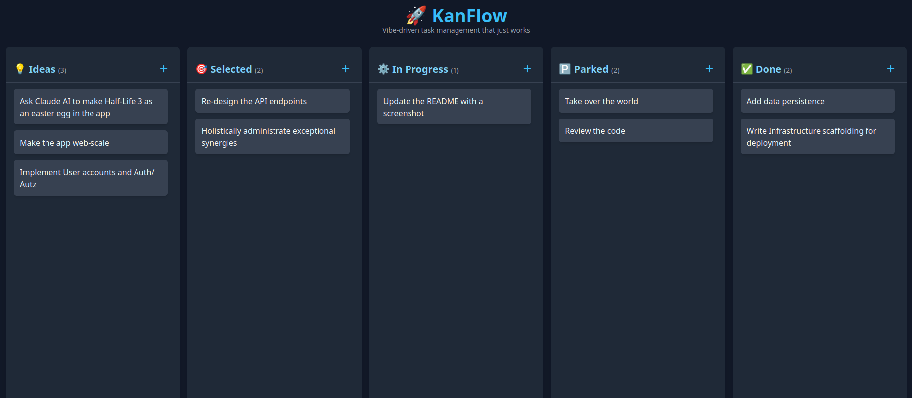

# FastAPI Kanban Board

A simple Kanban task management application built with React and FastAPI. I was looking for something very simple for my homelab.

This project was developed using vibe coding techniques with Claude Code CLI and Claude Web UI. I wanted to see what the fuss was all about with
the new agentic development platform. I must admit that I have been pretty impressed. I tried to not look at the code as much as I could, to
stay true to the spirit of vibe coding. However it means that I really, really can't trust it. But it is designed from the ground up to run
**in an isolated, safe environment**. Don't put this thing on the open internet. The AI say below that CORDS is enabled but that's a lie. It's
open to the world and very insecure.

You have been warned.



## Tech Stack

### Frontend

- **React 19** with TypeScript
- **Vite** for fast development and building
- **Tailwind CSS** for styling
- **Vitest** and Testing Library for comprehensive testing

### Backend

- **FastAPI** with Python
- **Pydantic** for data validation
- **CORS** enabled for cross-origin requests
- **JSON file storage** with automatic backups

## Getting Started

### Prerequisites

- Node.js (v18 or higher)
- Python 3.8+
- Poetry (for Python dependency management)

### Installation

1. **Clone the repository**

   ```bash
   git clone <repository-url>
   cd kanban
   ```

2. **Install frontend dependencies**

   ```bash
   npm install
   ```

3. **Install backend dependencies**
   ```bash
   cd backend && poetry install
   ```

### Running the Application

1. **Start the backend server**

   ```bash
   cd backend
   poetry run python app.py
   ```

   The API will be available at `http://localhost:8000`

2. **Start the frontend development server**
   ```bash
   VITE_API_BASE_URL=http://localhost:8000 nnpm run dev
   ```
   The application will be available at `http://localhost:5173`

### Configuration

If your backend API is running on a different port or URL, you can configure the frontend to use it by setting the `VITE_API_BASE_URL` environment variable:

```bash
VITE_API_BASE_URL=http://localhost:8000 npm run dev
```

## Available Scripts

```bash
make test # Run all the available tests
make fmt  # Format the code
```

## Data Persistence

Tasks are automatically saved to a `database.json` file with:

- Periodic backups every minute
- Automatic restoration on server restart
- Default sample data for new installations

## Testing

The project includes comprehensive test coverage:

- **Frontend**: Component tests, hook tests, and integration tests using Vitest and Testing Library
- **Backend**: API endpoint tests using pytest

Run all tests:

```bash
make test
```
